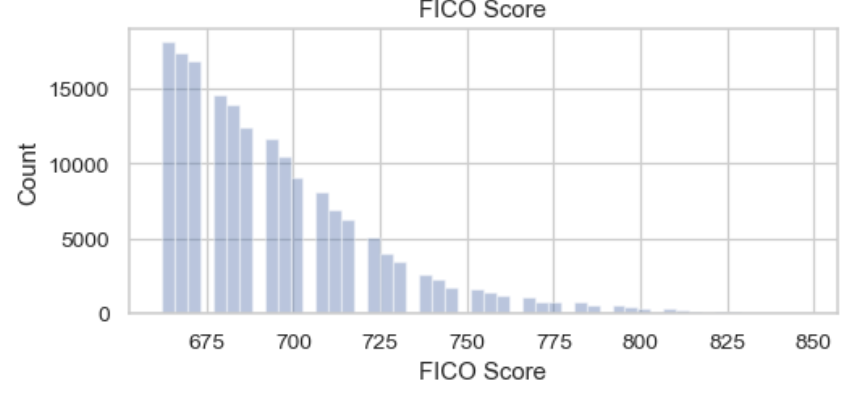
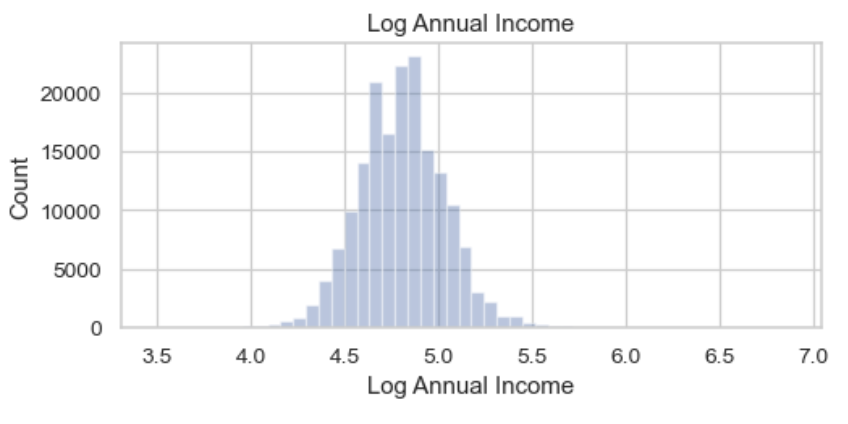
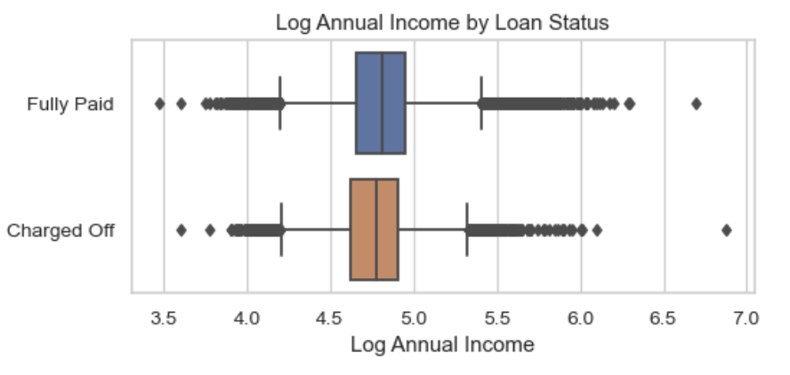
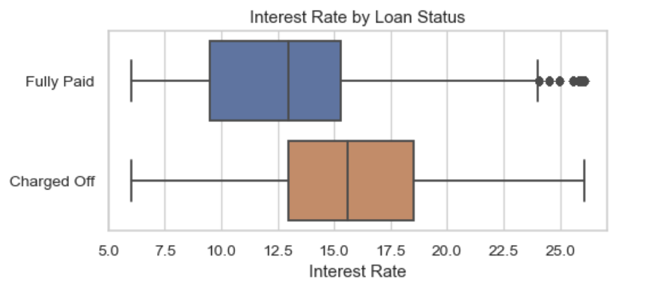
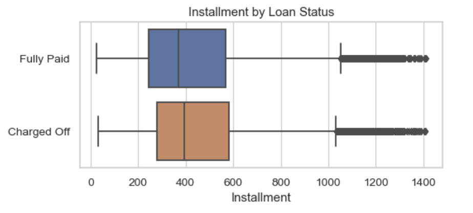
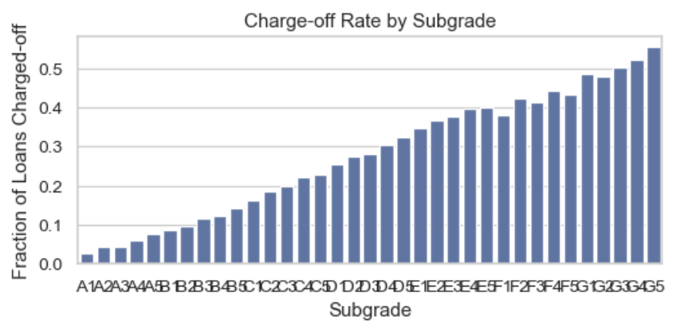
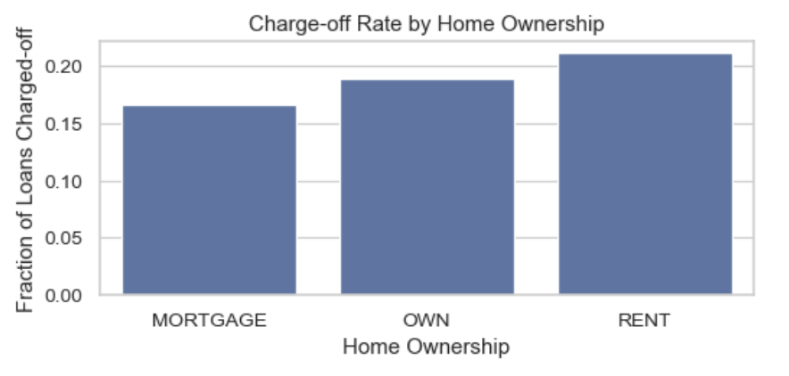
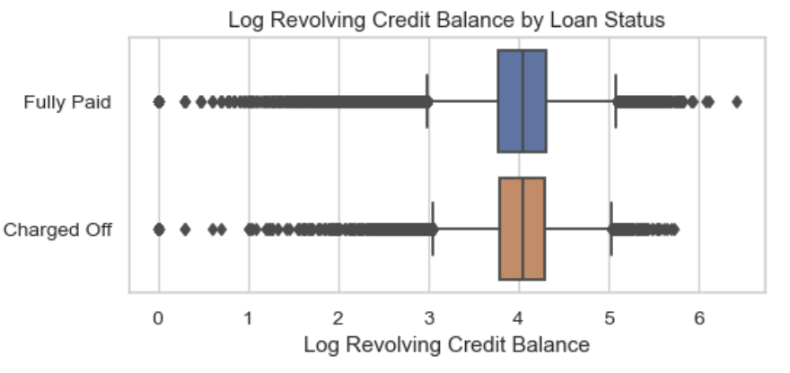

# Loan Default Prediction: Turning Consumer Credit Data Into Actionable Risk Intelligence

## Executive Summary
Lending decisions depend on accurately assessing borrower risk. Despite having rich loan-level and borrower-level data, traditional underwriting processes often rely on static credit metrics that fail to capture complex behavioral patterns.

In this project, I designed a complete data analytics and risk modeling pipeline using Python, Pandas, NumPy, and Scikit-Learn to analyze LendingClub’s historical loan dataset. My workflow transforms raw loan records into structured insights, visual risk indicators, and model-ready features.

The analysis reveals clear relationships between creditworthiness, financial stability, and the likelihood of loan charge-off—information that directly strengthens underwriting and portfolio management strategies.

## Business Problem
Lending institutions face three major challenges:

1. Identifying high-risk borrowers early  
2. Understanding which borrower attributes drive repayment behavior  
3. Building scalable, data-driven credit-risk models  

This project uncovers the variables most predictive of loan default and prepares the dataset for machine-learning models to enhance credit decisions.

## Methodology

### 1. Data Preparation
- Cleaned 350k+ loan records  
- Treated missing values  
- Applied log transforms to skewed variables  
- Encoded categorical features  
- Constructed charge-off target variable  

### 2. Exploratory Data Analysis (EDA)
Generated visualizations to understand borrower behavior, credit health, and repayment patterns.

### 3. Feature Engineering
- Log-scaled income & revolving balance  
- Extracted credit age  
- Created binary flags for categorical fields  
- Removed high-missingness features  

### 4. Modeling (Next Step)
Prepared dataset for Logistic Regression, Random Forest, and Gradient Boosting / XGBoost using metrics such as:

- AUC-ROC  
- Precision/Recall  
- Confusion Matrix  

# Key Visual Insights

## FICO Score Distribution

## Log Annual Income

## Income by Loan Status

## Interest Rate by Loan Status

## Installment Amount by Loan Status

## Subgrade Risk Curve

## Home Ownership & Risk

## Revolving Credit Behavior

# Summary of Insights
The strongest predictors of loan default include:

- Subgrade  
- FICO Score  
- Revolving Balance  
- Public Bankruptcies  
- Installment Amount  
- Interest Rate  
- Home Ownership  
- Verification Status  
- Credit History Length  

# Business Impact
This project enables:

- Better credit-risk scoring  
- Risk-adjusted interest pricing  
- More efficient underwriting  
- Lower default rates  
- Stronger loan portfolio health  

# Next Steps
1. Train ML models (LR, RF, XGBoost)  
2. Add SHAP explainability  
3. Deploy scoring API (FastAPI or AWS Lambda)  
4. Build Streamlit dashboard  
5. Add financial cost-sensitive evaluation  

# Tools & Technologies
- Python, Pandas, NumPy, Scikit-Learn  
- Matplotlib, Seaborn  
- Jupyter Notebook

# Author
Aurel Sahiti  
Data Science Graduate | Machine Learning & Consumer Credit Risk Analytics  
[GitHub](https://github.com/aurelsahiti) | [LinkedIn](https://linkedin.com/in/aurelsahiti)
